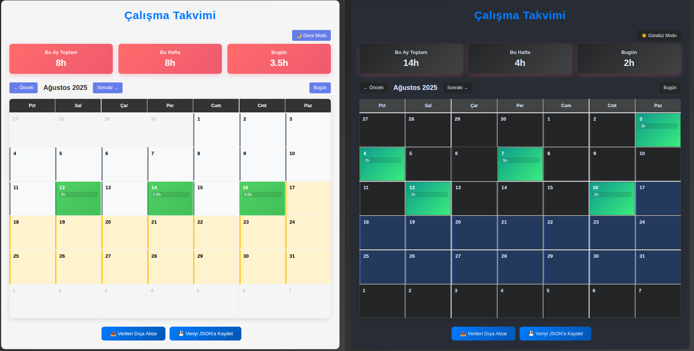

# mini_tools

**Work_Schedule** ile günlük çalışma saatinizi takip edebilir, haftalık ve aylık toplam çalışma saatlerinizi görebilir, her gün için ne yaptığınızı kısa not olarak kaydedebilirsiniz. Takvim üzerinden geçmiş ve gelecek günler için planlama yapabilir, verilerinizi dışa aktarabilirsiniz.

[Work_Schedule klasörüne gitmek için tıklayın.](./Work_Schedule/README.md)

